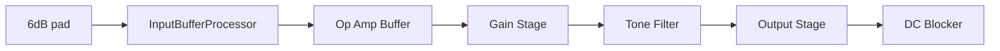

# Notes on Chow Centaur 

## Signal Flow

## JUCE Version

### `InputBufferProcessor`
- Inherits from `chowdsp::IIRFilter<1>`

### `GainStageProc`
-  Contains  `PreAmpWDF`, `ClippingWDF`, `FeedForward2WDF`, `AmpStage`, `SummingAmp`

### `ToneFilterProcessor`
- Inherits from `chowdsp::IIRFilter<1>`

### `OutputStageProc`
- Inherits from `chowdsp::IIRFilter<1>`

### `dcBlocker`
- Is a `juce::dsp::IIR::Filter<float>`

## Teensy Version
### `InputBuffer`
- Inherits from `AudioFilterBiquad`

### `preAmpStage`
- Contains WDF elements

### `ampStage`
- Inherits from `AudioFilterBiquad`

### `clippingStage`
- Contains WDF elements

### summing ff1, ff2, clippingStage
- Uses teensy mixer

### `summingAmp`
- Inherits from `AudioFilterBiquad`

### `toneControl`
- Inherits from `AudioFilterBiquad`

### `outputBuffer`
- Inherits from `AudioFilterBiquad`